```mermaid
flowchart LR
  A["Scout · Gemini Flash"] --> B["Judge · DeepSeek R1"]
  B --> C["Strategist · Llama 70B"]
  C --> D["Researcher · Gemini Flash"]
  D --> E["Orion · drafts article"]
  E --> F["Statistician · data tables"]
  F --> G["Inspector · schema + checks"]
  G --> H["Encoder"]
  H --> I["Publisher · no LLM, git push"]
  I --> J["Live site"]
```

  <strong>Suwaid Khan</strong>

  Product Manager who builds and ships AI agent systems.

I build autonomous AI agent systems end to end: content pipelines, voice agents, and knowledge-graph memory, with cost and quality controls wired in from the start. My background is product; I ship the working system so the product judgment behind it is verifiable, not just described. Open to Product Manager roles.

---

## Mind Your Macro — an 11-agent pipeline that publishes itself

An autonomous content system that takes a topic from keyword gap to a fact-checked, schema-tagged article committed live to a production site, with no human in the loop.

- **Problem:** ranking financial content needs both Google trust signals and a machine-readable surface that answer engines will cite, at a volume no single writer can sustain.
- **Built:** 11 specialized agents (Scout, Judge, Strategist, Researcher, Orion, Statistician, Inspector, Encoder, Publisher, then Diplomat and Closer for outreach) hand off through shared files, each doing one job and passing structured output to the next.
- **Cost routing as a product decision:** reasoning-heavy stages run on DeepSeek R1 (topic judging) and Llama 3.3 70B (strategy); the high-volume drafting, research, and validation stages run on cheap, fast Gemini 2.0 Flash; the Publisher uses no LLM at all, so the git push is deterministic and cannot hallucinate an action.
- **Outcome:** 40 published articles and 180+ commits in under two weeks, running against a live site.

Live: [suwaidakhan.github.io/mindyourmacro](https://suwaidakhan.github.io/mindyourmacro)

---

## Other projects

| Project | What it does | Stack | Status |
|---|---|---|---|
| [Edmonton Rental Comparer](https://github.com/suwaidakhan/Edmonton-Rental_Comparer) | Click-to-inspect rent, crime, school, and park data merged across 406 Edmonton neighbourhoods into one map | React, Vite, Leaflet, Tailwind | Public |
| [vezir-on-hermes](https://github.com/suwaidakhan/vezir-on-hermes) | LiveKit voice agent that answers a live phone line, plus a budget-capped AI ops assistant that runs cron jobs and lead-gen | Python, LiveKit, OpenAI Realtime | Public |
| [openclaw-memory](https://github.com/suwaidakhan/openclaw-memory) | Knowledge-graph memory service that routes an agent's tool and skill choices at runtime | FastAPI, Neo4j, Graphiti | Public |

---

How I think about building

 

- **Cost routing is a product decision.** On Mind Your Macro the expensive reasoning models run only on the stages that set direction (judging topics, planning strategy); the high-volume drafting runs on cheap models; the publish step runs on none. Spend follows risk and value, not habit.
- **Determinism where autonomy is dangerous.** The stage that pushes to a live site uses no LLM, so an autonomous pipeline still cannot invent a bad commit. Guardrails before automation, not after.
- **Honest status over inflated claims.** The Edmonton map shows a banner whenever a rent figure is a zone average rather than a true neighbourhood number, because a decision tool that hides its own data limits is worse than useless.

---

[LinkedIn](https://linkedin.com/in/suwaid) · suwaidakhan@gmail.com
