<h1>Hi, I'm Suwaid 👋</h1>

I'm a product manager who builds and ships AI agent systems end to end: autonomous content pipelines, voice agents on live phone lines, and knowledge-graph memory that agents use to make decisions.

Most of my work is hands-on. I frame the product, build the system, wire in the cost and quality controls, and ship it, so the product thinking behind it is something you can clone, run, and inspect.

My main project is [Mind Your Macro](https://suwaidakhan.github.io/mindyourmacro), an 11-agent pipeline that researches, writes, fact-checks, and publishes financial content to a live site with no human in the loop. 40 articles and 180+ commits in under two weeks.

**What I work on**

- AI agents: multi-agent pipelines, voice agents, autonomous publishing, agent memory
- Cost-aware model routing: expensive reasoning models where judgment matters, cheap fast models for the volume work, plain deterministic code where autonomy would be dangerous
- End-to-end product: problem framing, system design, QA gates, shipping to production
- Knowledge graphs and RAG: Neo4j and Graphiti memory layers that route an agent's tools and skills at runtime
- Data products: stitching public datasets into decision tools people can actually use

**Featured projects**

- **[Mind Your Macro](https://github.com/suwaidakhan/mindyourmacro)** · 11-agent pipeline that researches, writes, fact-checks, and publishes to a live site on its own. [Live demo](https://suwaidakhan.github.io/mindyourmacro). Python, OpenRouter routing, Jekyll.
- **[vezir-on-hermes](https://github.com/suwaidakhan/vezir-on-hermes)** · LiveKit voice agent on a live phone line, plus a budget-capped ops assistant running cron jobs and lead-gen. Python, LiveKit, OpenAI Realtime.
- **[openclaw-memory](https://github.com/suwaidakhan/openclaw-memory)** · Knowledge-graph memory service that routes an agent's tool and skill choices at runtime. FastAPI, Neo4j, Graphiti.
- **[Edmonton Rental Comparer](https://github.com/suwaidakhan/Edmonton-Rental_Comparer)** · Interactive map merging rent, crime, school, and park data across 406 Edmonton neighbourhoods into one decision tool. React, Leaflet.

How the Mind Your Macro pipeline works

 

Eleven agents hand off through shared files. Reasoning-heavy stages run on DeepSeek R1 and Llama 3.3 70B; high-volume drafting runs on cheap Gemini 2.0 Flash; the Publisher uses no LLM at all, so the git push is deterministic and cannot hallucinate an action.

```mermaid
flowchart LR
  A["Scout · Gemini Flash"] --> B["Judge · DeepSeek R1"]
  B --> C["Strategist · Llama 70B"]
  C --> D["Researcher · Gemini Flash"]
  D --> E["Orion · drafts article"]
  E --> F["Statistician · data tables"]
  F --> G["Inspector · schema + checks"]
  G --> H["Encoder"]
  H --> I["Publisher · no LLM, git push"]
  I --> J["Live site"]
```

<h2>About Me</h2>

- **Product manager who ships.** My background is product; I build the systems myself, so the judgment behind a roadmap is something you can verify.
- Based in Edmonton, Alberta.
- I care about the unglamorous parts of agent products: where to spend expensive tokens, what has to stay deterministic, and how a system fails safely when it runs with no human watching.

**Open to Product Manager roles. Building something with AI agents? I'd love to talk.**

[LinkedIn](https://linkedin.com/in/suwaid) · suwaidakhan@gmail.com
